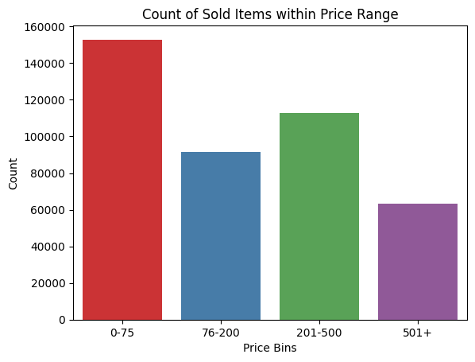
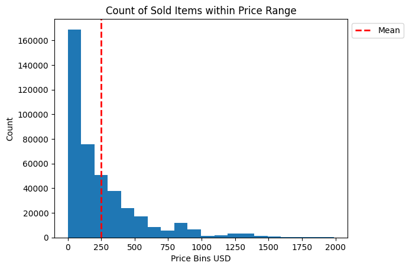
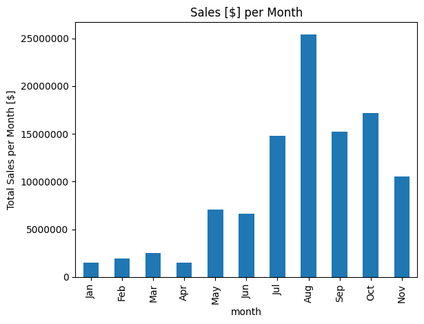
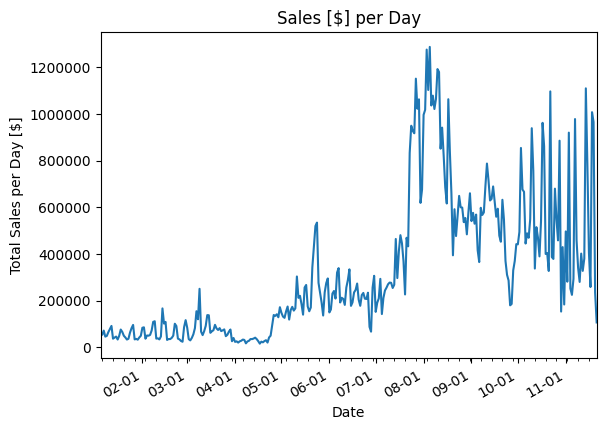
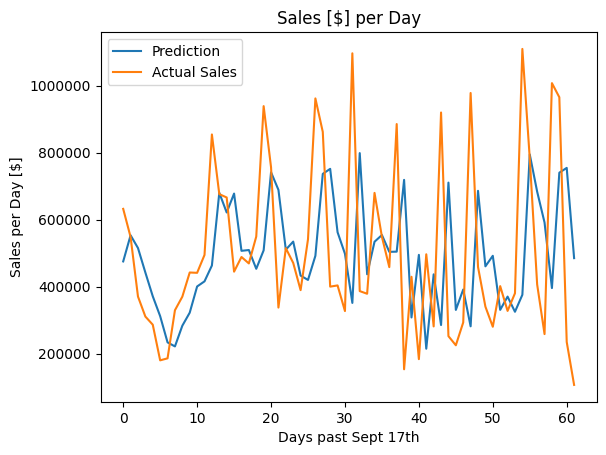
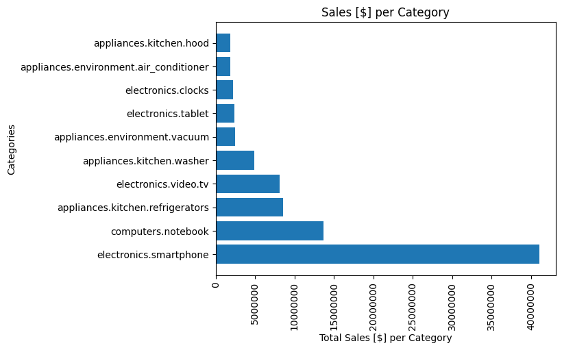

**Sales Analytics Project: Predicting Customer Demand to Improve Sales**

**Introduction:**

This sales analytics project aims to predict customer demand to improve sales for an electronics store. The dataset used in this project consists of 2.6 million rows and 8 columns, including information such as 'event_time', 'order_id', 'product_id', 'category_id', 'category_code', 'brand', 'price', and 'user_id'.

**Steps Taken:**

1. **Data Cleaning and Preprocessing:**
   - Loaded the dataset from a CSV file using pandas.
   - Checked the first few rows of the dataset using `df.head()`.
   - Checked the shape of the dataset using `df.shape`.
   - Checked the columns in the dataset using a loop.
   - Checked data types using `df.dtypes`.
   - Examined null values using `df.isnull().sum()`.
   - Created a copy of the dataset named 'sales'.
   - Dropped rows with null values.
   - Renamed the 'event_time' column to 'event_datetime'.
   - Extracted 'event_date' and 'event_time' from 'event_datetime'.
   - Dropped the original 'event_datetime' column.
   - Set 'order_id' as the index.
   - Explored the number of unique orders and users.
   - Checked the drop percentage after removing null values.
   - Created price bins and visualized the count of sold items within price ranges using a count plot. 
      
   - Created a histogram showing the count of sold items within different price ranges.  
      
   - Explored sales trends per month and per day using line and bar plots. 
      
      

2. **Machine Learning Model (Sales Prediction):**
   - Used the previous 3 days of sales data to predict sales for the next day.
   - Created lag features for the past 3 days.
   - Implemented a linear regression model.
   - Split the data into training and testing sets.
   - Trained the model and evaluated its performance.
   - Visualized the predicted sales and actual sales for the test set.
      

3. **Additional Analysis:**
   - Explored sales trends for the top categories.
   - Created a bar plot showing total sales per category.
      

**Key Findings:**

1. The dataset contains a significant number of repeat buyers.
2. Most products (by count) were sold for less than $75, but there are high-value transactions above $500.
3. Sales trends show seasonality and variation in daily and monthly patterns.
4. The linear regression model suggests that past sales data, especially the previous day's sales, is a good predictor of current day sales.
5. The model achieved an R-squared value of 74%, indicating a good fit to the data.
6. The model successfully predicted sales trends, reacting to increases/decreases in sales volume.

**Recommendations:**

1. Focus marketing efforts on top-performing categories, such as smartphones and computer notebooks.
2. Utilize the developed sales prediction model to optimize inventory management and meet customer demand more efficiently.

**Conclusion:**

This sales analytics project provides valuable insights into customer behavior, sales trends, and a predictive model to enhance decision-making processes for an electronics store. It combines descriptive analytics, exploratory data analysis, machine learning, and visualization techniques to uncover patterns and improve overall business performance.

